<div align="center">

<!-- HERO -->


<!-- ANIMATED IDENTITY -->


<!-- SOCIAL NAV -->
<br/>

<a href="https://github.com/sanath-2512" title="GitHub"></a>
&nbsp;&nbsp;
<a href="https://www.linkedin.com/in/sanath-waraikar-4ba35b308/" title="LinkedIn"></a>
&nbsp;&nbsp;
<a href="https://portfolioo-one-gamma.vercel.app" title="Portfolio"></a>
&nbsp;&nbsp;
<a href="https://portfolioo-one-gamma.vercel.app/resume-sanath-waraikar.pdf" title="Resume"></a>
&nbsp;&nbsp;
<a href="mailto:sanath.waraikar2024@nst.rishihood.edu.in" title="Email"></a>

</div>


<!-- WHO I AM -->
<table width="100%">
<tr>
<td>

### `> whoami`

```text
Engineering student at Rishihood University.
Full-stack builder shipping AI-powered web applications.
I design systems where LLMs produce structured, usable output -
not demo-ware. Open-source contributor, GSSoC 2025.
```

</td>
</tr>
</table>


<!-- CURRENTLY BUILDING -->
<div align="center">
  
</div>


<!-- FEATURED PROJECTS -->
<div align="center">

### `featured_projects`

<i>Products that define what I build - intelligent systems with real user flows.</i>

<br/><br/>

<table>
<tr>
<td>

**WorthyApply**
> Multi-agent job intelligence - structured analysis, match score, skill gaps.


[](https://github.com/sanath-2512/Worthyapply) [](https://worthyapply-sigma.vercel.app)

</td>
<td>

**EduAI**
> AI-native learning platform - generates courses and quizzes from topics.


[](https://github.com/sanath-2512/EduAI.) [](https://edu-ai-rho-hazel.vercel.app)

</td>
</tr>
<tr>
<td>

**portfolioo**
> Design meets engineering - Three.js hero and project showcase.


[](https://github.com/sanath-2512/portfolioo) [](https://portfolioo-one-gamma.vercel.app)

</td>
<td>

**Viewly**
> Polished frontend craft focused on layout and component design.


[](https://github.com/sanath-2512/Viewly) [](https://viewlyy.netlify.app)

</td>
</tr>
</table>

<br/>

#### 🎮 Maths Balance — GameDev.js Jam 2025

> Educational browser game teaching mathematical balance through interactive scenarios.


[](https://github.com/sanath-2512/MathsBalance-gamdevjs-2025)
[](https://mavros-lykos.itch.io/math-balance)

</div>


<!-- SIGNATURE COMPONENT -->
<div align="center">

### `agent_pipeline`

<i>Custom visualization of how I architect AI products - from raw input to deployed software.</i>


</div>


<!-- TECH ECOSYSTEM -->
<div align="center">

### `tech_ecosystem`

<br/>

**LANGUAGES**


<br/>

**AI / ML**


<br/>

**BACKEND**


<br/>

**FRONTEND & DEPLOY**


</div>


<!-- ACTIVITY -->
<div align="center">

### `activity`

<i>Real contribution data fetched from GitHub — auto-updated daily via GitHub Actions.</i>

</div>




<!-- CONNECT -->
<div align="center">

### `connect`

Building useful AI systems - open to collaboration on ambitious products

<br/>

<a href="https://github.com/sanath-2512"></a>
&nbsp;
<a href="https://www.linkedin.com/in/sanath-waraikar-4ba35b308/"></a>
&nbsp;
<a href="https://portfolioo-one-gamma.vercel.app"></a>
&nbsp;
<a href="mailto:sanath.waraikar2024@nst.rishihood.edu.in"></a>

<br/><br/>

<sub>custom SVG assets • readme-typing-svg • shields.io badges • GitHub Actions activity graph</sub>

</div>
